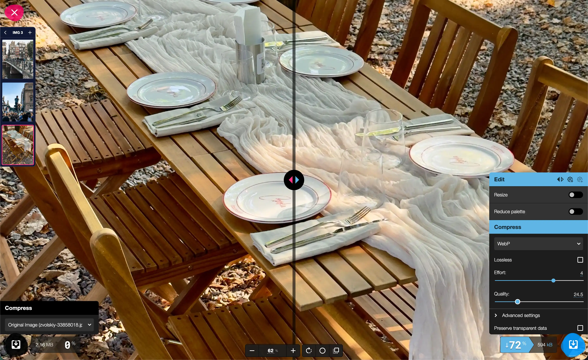

<div align="center">
  
  <h1>Vicoco Free Image Compressor</h1>
  <p>Free, private image compression and conversion in your browser.</p>
  <p><a href="https://vicoco.uk"><strong>Open Vicoco</strong></a></p>
</div>



Vicoco is a free image compressor and converter built on [Squoosh](https://squoosh.app). Add one image or a folder, preview compression results, and download smaller files without uploading images to a server.

## Features

- Batch queue for multiple images
- JPEG, PNG, WebP, AVIF, SVG, and other supported inputs
- Side-by-side quality and file-size comparison
- One set of export settings for the entire batch
- Custom ZIP filename and processing progress
- Local browser processing: images are not uploaded
- Installable PWA

## Use the app

1. Open [vicoco.uk](https://vicoco.uk).
2. Drop or select multiple images.
3. Choose an image and tune the output settings.
4. Start the batch and download the ZIP.

## Privacy

Image compression and conversion run locally in your browser. Your images do not leave your device.

The app uses Google Analytics for basic usage metrics. It does not upload image contents.

## Development

Requires Node.js 22.

```sh
npm install
npm run build
npm run dev
```

The development server runs at [http://localhost:3010](http://localhost:3010).

## Contributing

See [CONTRIBUTING.md](CONTRIBUTING.md).

## Credits

Vicoco is built on the open-source [Squoosh](https://github.com/GoogleChromeLabs/squoosh) project.

Licensed under the [Apache License 2.0](LICENSE).
